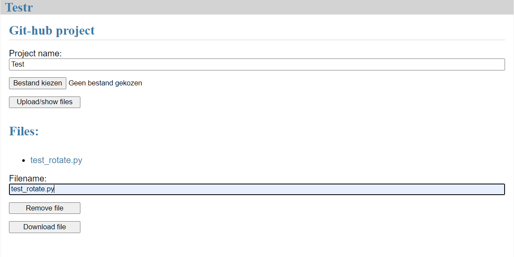

Bij dit project is een webapplicatie ontwikkeld die automatisch een github project test als er een push gemaakt wordt. Hiervoor wordt Pytest gebruikt. Om het op te zetten voor een project is het nodig om een webhook op te zetten naar www.testr.devops.quinner.nl/webhook. Daarbij moeten ook de test bestanden geupload worden op de webpagina. Daarna wordt het vanzelf getest en wordt het resultaat naar de webhook teruggestuurd.
Hieronder is de layout van de webpagina te zien:

Door de naam van je project in te vullen kan je vervolgens voor dat project de test bestanden managen. Als je op 'Upload/show files' klikt upload het gekozen bestand, als er geen bestand gekozen is wordt kan je wel zien welke bestanden er voor dat project op de server staan. Vervolgens kan je daaronder de bestanden downloaden of verwijderen, hiervoor moet je onder 'Filename:' de bestandsnaam invullen. Dan kan je met de knoppen eronder het bestand verwijderen of downloaden. 
