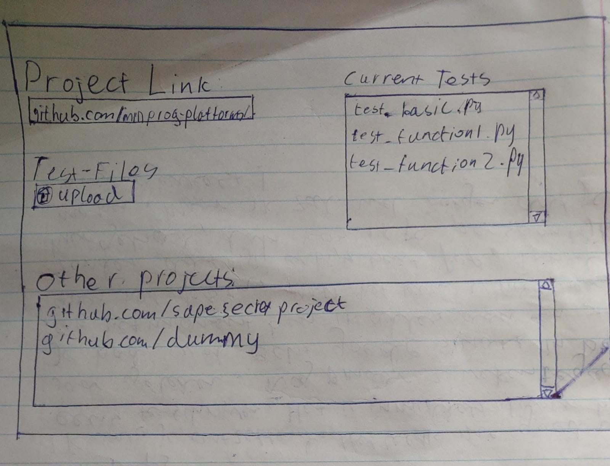

## Probleem
Bij het ontwikkelen van een (groot) project moeten er vaak bestanden toegevoegd of veranderd worden. Hierbij kunnen gemakkelijk bugs/conflicten ontstaan. Dit kan zorgen dat essentiele bestanden in een project niet meer bruikbaar zijn en er dus hard gezocht moet worden waar de fout is ontstaan of dat er een backup gebruikt moet worden en dan gaat er dus werk verloren.

## Oplossing
Hierom wil ik een applicatie ontwikkelen die automatisch een github project test zodra er aanpassingen gemaakt worden. Dit zorgt dat fouten direct worden opgemerkt en dat het dus ook makkelijk te achterhalen is bij welke push er een fout ontstaan is.

Met dit interface is een gebruiker in staat om een project te linken met bestanden die de code kunnen testen. Door een link naar het project in te stellen en de juiste testbestanden te uploaden is het mogelijk om de tests te laten draaien zodra er een bestand toegevoegd of aangepast wordt bij dit project. Misschien is het handig om een remove en download functie te hebben voor de testbestanden.

## Benodigheden
De applicatie heeft weinig gegevens nodig om te kunnen werken. Hij moet toegang hebben tot het github project en hij moet de test bestanden paraat hebben. De toegang tot het project kan geregeld worden door een github-gebruiker aan de applicatie te koppelen, dan moet deze gebruiker nog wel aan het project toegevoegd worden.
Om te kunnen testen moeten testomgevingen gedownload worden zoals bijvoorbeeld pytest. Anders zou de applicatie de test-bestanden niet kunnen uitvoeren. Om te testen zal de applicatie het hele project van github pullen. Misschien dat er nog onderscheidt gemaakt kan worden tussen relevante bestanden, maar het risico is dan wel dat er toch een bestand niet gepulled wordt dat achteraf wel nodig blijkt. Denk aan een plaatje dat in de code aangeroepen wordt o.i.d.. Zodra alle test-bestanden gedraaid hebben moeten de resultaten opgeslagen worden. Hierbij kan er gedacht worden aan mail, of een aparte map in het project. 
De testbestanden kunnen simpelweg in de container gedownload worden zodra ze toegevoegd worden door de gebruiker.
Om te zorgen dat er wat gebeurd zodra er een nieuwe file gepushed wordt kunnnen git-hooks gebruikt worden, die staan in de volgende link uitgelegd:
https://www.atlassian.com/git/tutorials/git-hooks 

## Mogelijkheden
Er kan ook bij elke test uitgezocht welke bestanden relevant kunnen zijn, maar dit kan moeilijkheden meebrengen omdat uit het type bestand niet altijd op te maken is of het relevant is. Een .c bestand kan relevant zijn voor pytest omdat de functie daarvan aangeroepen kan worden in een .py bestand. Daarbij kunnen plaatjes bijvoorbeeld ook relevant zijn omdat die gebruikt worden in een output.
Het kan zijn dat bij grote projecten er veel bestanden gepushed worden. Dan is het misschien niet handig dat elke keer alle tests uitgevoerd worden. Misschien kan er een timer op de test gezet worden? Dat maximaal elk uur een test wordt uitgevoerd.
